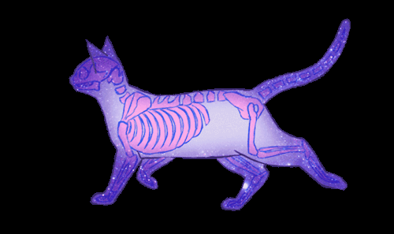

**Final Year B.Tech CSE Student** | **Data Science Enthusiast**  

## About Me
- Passionate about **Data Structures & Algorithms**, **Data Science**, and **Full-Stack Development**  
- Experienced in **Python**, **Java**, **SQL**, and **Web Technologies**  
- Interested in **Machine Learning**, **Topic Modeling (LDA)**, and **Big Data Tools** like Hadoop & Hive  
- Currently exploring **Advanced DSA** and **Scalable Data Processing**  
- Internship: **Data Science Intern @ Celebal Technologies**  

## Tech Stack

**Languages**  

  

**Frameworks & Tools**  

  

## Featured Projects

### [Hate Speech Detection](https://github.com/ChelsaMJ/Hate-Speech-Detection)
A Natural Language Processing project that detects and classifies hate speech from text data.  
**Highlights:**
- Used **TF-IDF vectorization** and **Logistic Regression** for classification  
- Preprocessed datasets to handle imbalanced classes using **SMOTE**  
- Achieved high F1-score through fine-tuned model hyperparameters  

---

### [20 Newsgroups Topic Modeling](https://github.com/ChelsaMJ/Celebal-Summer-Internship/tree/main/Project)
Unsupervised learning project applying **Latent Dirichlet Allocation (LDA)** to the 20 Newsgroups dataset for topic discovery.  
**Highlights:**
- Implemented text preprocessing: tokenization, stopword removal, and lemmatization  
- Applied **Gensim’s LDA model** to extract coherent topics  
- Visualized results using **pyLDAvis** for better interpretability

---

### [Loan Approval Assistant – RAG Q&A Chatbot](https://github.com/ChelsaMJ/RAG-QnA-Chatbot)
[app link](https://rag-q-a-chatbot-f4qggzlbwcf3kaz3b7rnrs.streamlit.app/)

A Retrieval-Augmented Generation (RAG) chatbot that answers intelligent queries based on real loan applicant data.  
**Highlights:**
- Ingests and chunks structured loan datasets for semantic search
- Builds vector search index using **TF-IDF + FAISS**
- Retrieves relevant data chunks and uses **Gemini 1.5 Pro** for human-like answers
- Deployed via **Streamlit** for interactive user experience  
**Tech Stack:** Python, Streamlit, FAISS, TF-IDF, Google GenerativeAI (Gemini), Pandas

---

### [Word Autocorrector using NLP](https://github.com/ChelsaMJ/Word-Autocorrector-using-NLP)
An improved word-level autocorrector that suggests accurate spelling corrections using advanced NLP techniques.  
**Highlights:**
- Integrated **spaCy** for lemmatization and **NLTK corpora** for real vocabulary coverage
- Ranked suggestions by **Brown corpus frequency** for realistic recommendations
- Edit-distance-based candidate generation with robust error handling
- Vastly improved over v1.0, which relied on a limited custom vocabulary  
**Tech Stack:** Python, spaCy, NLTK, Brown Corpus, Edit-Distance Algorithm

---

### [Entrenet – Entrepreneur Networking App](https://github.com/ChelsaMJ/Entrenet-Android-App)
An Android application designed to connect entrepreneurs with mentors and foster collaboration.  
**Highlights:**
- User profiles for entrepreneurs and mentors
- Real-time chat and messaging system
- Article posting and discussion threads for knowledge sharing
- Clean and user-friendly **Material Design UI**  
**Tech Stack:** Java (Android), XML, Firebase (Authentication & Realtime Database)

## GitHub Stats

<table>
  <tr>
    <td>
      
       
      
    </td>
    <td>
      
    </td>
  </tr>
</table>

## LeetCode Stats

  
  

## Connect with Me
 

*"Code. Debug. Learn. Repeat."*

